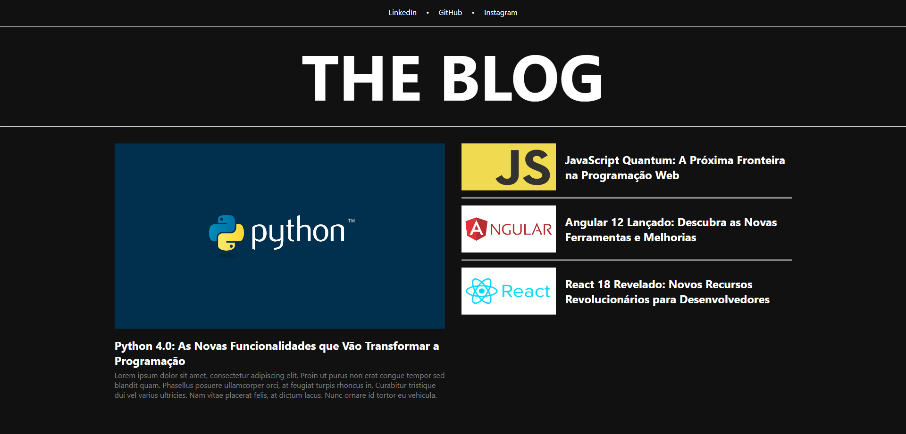

# ❤ Angular-Blog

Blog fictício sobre programação construído com Angular usando sistema de rotas com error boundaries, injeção de dependências e dados dinâmicos.

[Clique aqui para acessar](https://angular-blog-ivory.vercel.app/)

## 🛠 Tecnologias

- TypeScript
- Angular
- HTML
- CSS
